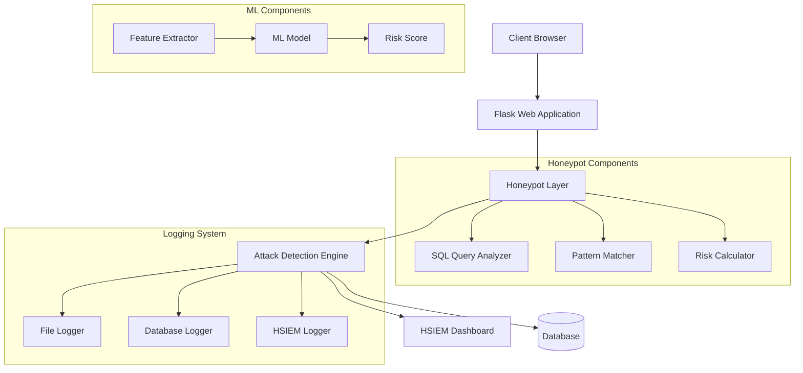
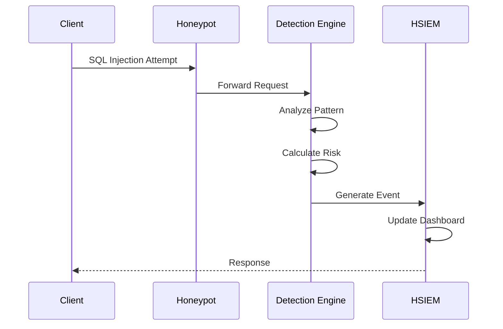

# SQL Injection Honeypot with HSIEM: Project Report

## Table of Contents
1. [System Architecture](#system-architecture)
2. [Methodology](#methodology)
3. [Implementation Details](#implementation-details)
4. [Attack Detection and Analysis](#attack-detection-and-analysis)
5. [Risk Assessment](#risk-assessment)

## System Architecture



### Component Description

1. **Web Application Layer**
   ```mermaid
   graph LR
       A[User Input] --> B[Input Sanitization]
       B --> C[Query Builder]
       C --> D[Honeypot DB]
       C --> E[Real DB]
   ```

2. **HSIEM Architecture**
   ```mermaid
   graph TD
       A[Attack Event] --> B[Event Processor]
       B --> C[Risk Calculator]
       C --> D[Alert Generator]
       D --> E[Dashboard]
       D --> F[Log Storage]
   ```

## Methodology

The SQL Injection Honeypot with HSIEM implements a multi-layered approach to detect, analyze, and monitor SQL injection attacks in real-time. The system combines traditional pattern matching with machine learning techniques to provide comprehensive attack detection and risk assessment.

### Attack Detection Strategy

1. **Input Analysis Layer**
   - Monitors all incoming HTTP requests
   - Analyzes query parameters, form data, and headers
   - Identifies potential SQL injection patterns
   - Implements tokenization for query analysis

2. **Pattern Recognition**
   - Uses regular expressions for basic pattern matching
   - Implements syntax analysis for SQL query structure
   - Maintains a database of known attack signatures
   - Updates patterns based on new attack vectors

3. **Machine Learning Integration**
   - Feature extraction from incoming requests
   - Real-time classification of attack patterns
   - Risk score calculation using trained models
   - Continuous model updating based on new data

4. **Honeytoken Management**
   - Strategic placement of fake sensitive data
   - Monitoring of honeytoken access attempts
   - Correlation of honeytoken triggers with attacks
   - Dynamic honeytoken generation and rotation

5. **Risk Assessment**
   - Multi-factor risk scoring algorithm
   - Context-aware severity classification
   - Historical pattern analysis
   - Attack impact evaluation

The system employs a defense-in-depth strategy, where each layer provides additional security and monitoring capabilities. The HSIEM component aggregates data from all layers to provide comprehensive attack visibility and analysis.

## Implementation Details

### Core Components Pseudocode

1. **Attack Detection Engine**
```python
class AttackDetectionEngine:
    def analyze_request(request):
        # Extract request parameters
        params = extract_parameters(request)
        
        # Pattern matching
        if contains_sql_injection_pattern(params):
            attack_type = classify_attack_type(params)
            risk_score = calculate_risk_score(params, attack_type)
            
            # Log attack
            log_attack(params, attack_type, risk_score)
            
            # Generate HSIEM event
            generate_hsiem_event(params, attack_type, risk_score)
            
        return safe_response()

    def classify_attack_type(params):
        # Check for known patterns
        for pattern in ATTACK_PATTERNS:
            if pattern.matches(params):
                return pattern.attack_type
        
        # ML-based classification
        return ml_model.predict(extract_features(params))

    def calculate_risk_score(params, attack_type):
        # Base risk score
        risk = 0.0
        
        # Pattern-based scoring
        risk += pattern_risk_score(params)
        
        # ML-based scoring
        risk += ml_risk_score(params)
        
        # Context-based factors
        risk += context_risk_score(params, attack_type)
        
        return normalize_risk_score(risk)
```

2. **HSIEM Event Processing**
```python
class HSIEMProcessor:
    def process_event(attack_event):
        # Enrich event data
        enriched_event = enrich_event_data(attack_event)
        
        # Calculate final risk score
        risk_score = calculate_final_risk(enriched_event)
        
        # Generate alerts if needed
        if risk_score > ALERT_THRESHOLD:
            generate_alert(enriched_event)
        
        # Update dashboard
        update_dashboard(enriched_event)
        
        # Store event
        store_event(enriched_event)

    def enrich_event_data(event):
        # Add IP reputation data
        event.ip_data = lookup_ip_reputation(event.source_ip)
        
        # Add attack pattern info
        event.pattern_info = lookup_attack_pattern(event.signature)
        
        # Add historical context
        event.historical_data = get_historical_context(event)
        
        return event

    def calculate_final_risk(event):
        # Combine multiple risk factors
        risk = 0.0
        risk += event.base_risk_score * WEIGHT_BASE
        risk += ip_reputation_score(event) * WEIGHT_IP
        risk += historical_score(event) * WEIGHT_HISTORY
        risk += pattern_severity_score(event) * WEIGHT_PATTERN
        
        return normalize_risk_score(risk)
```

3. **Machine Learning Component**
```python
class MLComponent:
    def extract_features(request):
        features = []
        
        # Extract query structure
        features += extract_query_features(request.query)
        
        # Extract payload characteristics
        features += extract_payload_features(request.payload)
        
        # Extract context features
        features += extract_context_features(request)
        
        return features

    def predict_risk(features):
        # Preprocess features
        processed_features = preprocess_features(features)
        
        # Get base prediction
        base_prediction = model.predict(processed_features)
        
        # Apply confidence scoring
        confidence = model.predict_proba(processed_features)
        
        # Combine with other factors
        final_score = combine_scores(base_prediction, confidence)
        
        return final_score
```

## Attack Detection and Analysis

### Attack Classification Matrix

| Severity | Risk Score | Characteristics | Response |
|----------|------------|-----------------|----------|
| LOW | 0.0-0.3 | Basic patterns (comments, LIKE injections) | Log and Monitor |
| MEDIUM | 0.3-0.5 | Authentication bypass attempts (OR/AND conditions) | Alert and Log |
| HIGH | 0.5-0.7 | Data extraction attempts (UNION SELECT) | Immediate Alert |
| CRITICAL | 0.7-1.0 | Schema enumeration (information_schema), Destructive attempts (DROP/DELETE) | Emergency Response |

### Pattern Recognition
The system uses weighted pattern matching for initial classification:

1. **CRITICAL Patterns** (Base weight: 0.7)
   - Information schema access
   - DROP/DELETE operations
   - System table enumeration

2. **HIGH Patterns** (Base weight: 0.5)
   - UNION-based injections
   - Data modification (INSERT/UPDATE)
   - Bulk data extraction

3. **MEDIUM Patterns** (Base weight: 0.4)
   - Boolean-based bypasses
   - Authentication bypasses
   - Conditional manipulations

4. **LOW Patterns** (Base weight: 0.2)
   - Comment injections
   - Basic LIKE injections
   - Simple tautologies

### Risk Scoring Algorithm

The risk score is calculated using the following formula:

\[ FinalRiskScore = 0.7P + 0.3M \]

Where:
- P = Pattern-based risk score (0-1)
- M = Machine Learning risk score (0-1)

Additional factors:
- Multiple pattern bonus: +0.1 per additional pattern detected
- Maximum score capped at 1.0
- Minimum detection threshold: 0.2

### Risk Score Components

1. **Pattern-based Score (70% weight)**
   - Based on matched attack patterns
   - Weighted by severity level
   - Multiple pattern detection bonus

2. **Machine Learning Score (30% weight)**
   - Feature-based classification
   - Historical pattern analysis
   - Contextual risk assessment

## Risk Assessment

### Real-time Monitoring


The system provides continuous monitoring and assessment of attacks, with real-time updates to the HSIEM dashboard and immediate alerting for high-risk events. 